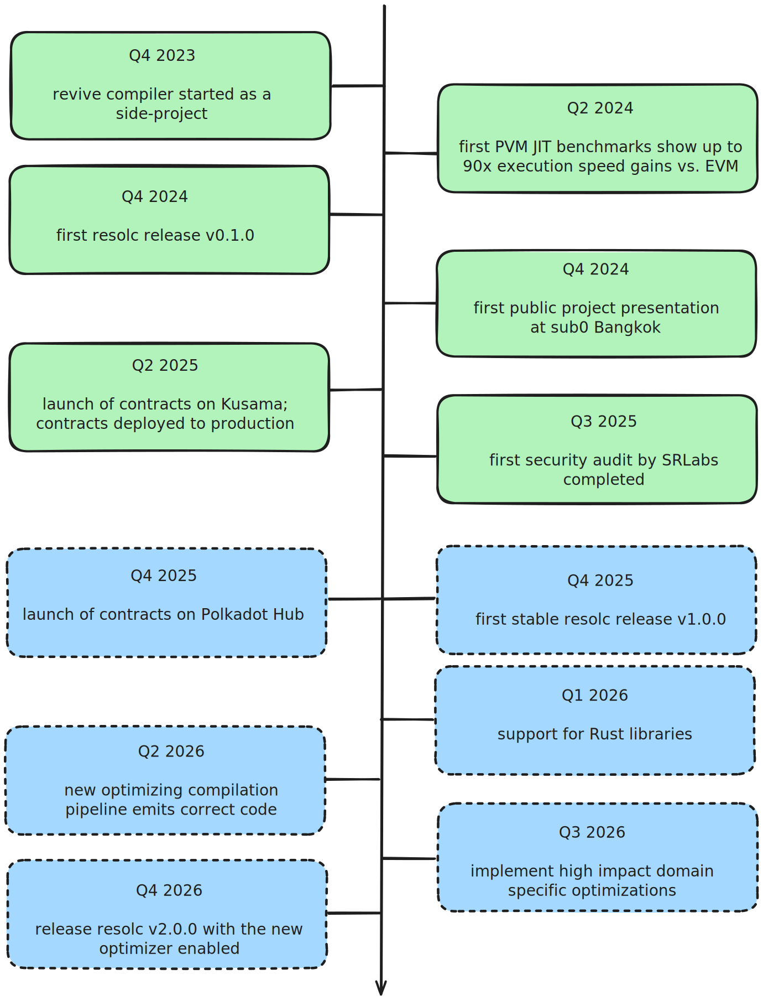

# Roadmap and Vision

The `revive` compiler speeds up Solidity contracts by orders of magnitude. `revive` provides a decisive edge over other contract platforms. Notably, the compiler eliminates the need of rewriting Solidity dApps as single dApp parachains for scaling reasons. Retaining as high compatibility with Ethereum Solidity as possible keeps entry barriers low.

We believe in Dr. Gavin Wood's [ĐApps: What Web 3.0 Looks Like](https://gavwood.com/dappsweb3.html) manifesto and the ecosystem of the Solidity programming language. Our motivation lies in the realization that for a _true_ web3 revolution, significant scaling efforts, like the ones provided by the PVM and this project, are necessary to unfold.

## Roadmap

The first major release, `resolc` v1.0.0, emits functional PVM code from given Solidity sources. It relies on `solc` and LLVM for optimizations. The main priority of this release was delivering a mostly feature complete and safe Solidity v0.8.0 compiler.

Focus for the second major release is on the custom optimization pipeline, which aims to significantly improve emitted code blob sizes.

The below roadmap gives a rough overview of the project's development timeline.

